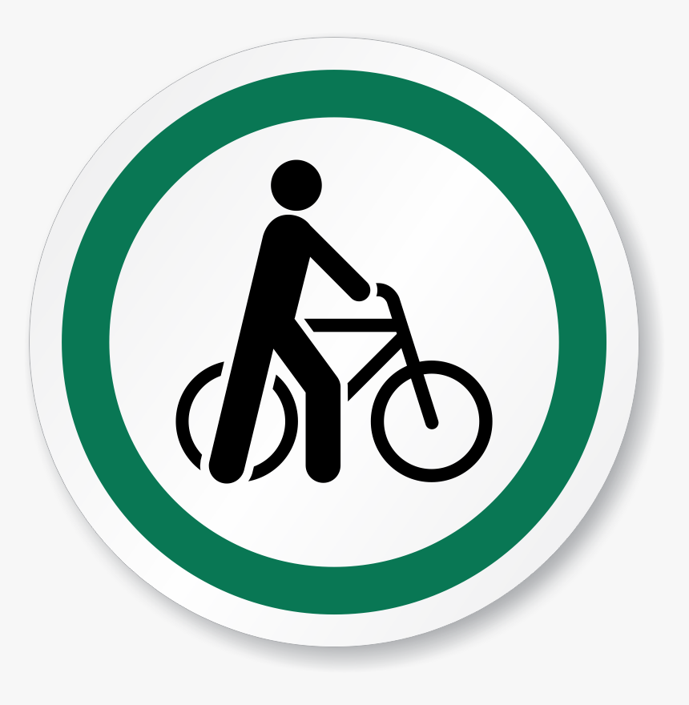

# -Bicycle_Route_Finder
 Bicycle Route Finder
# Bicycle Route Finder



> Find bicycle routes between locations and get turn-by-turn directions.

## Table of Contents

- [Introduction](#introduction)
- [Deployment](#deployment)
- [Installation](#installation)
- [Usage](#usage)
- [Contributing](#contributing)
- [Related Projects](#related-projects)
- [License](#license)

## Introduction

Bicycle Route Finder is a web application that allows users to find bicycle routes between two locations. It utilizes the Google Maps API to provide accurate route information and turn-by-turn directions. This project is designed to help cyclists plan their rides and discover the most suitable routes for their needs.

Live Demo: (https://bicycleroutefinder.000webhostapp.com/)) 
Project Blog Article:  (https://developer366.blogspot.com/2023/06/bicycle-route-finder.html)
Author LinkedIn: (https://linkedin.com/in/abubakarSani)

## Deployment

The application is deployed and accessible at https://bicycleroutefinder.000webhostapp.com/.

For more details about the project, its features, and the development process, please refer to the project blog article: https://developer366.blogspot.com/2023/06/bicycle-route-finder.html).

## Installation

To run the Bicycle Route Finder locally, follow these steps:

1. Clone the repository:

   ```shell
   git clone https://github.com/abubakargithub/-bicycle_route_finder.git
Install the necessary dependencies:

shell
Copy code
cd bicycle-route-finder
# Use npm if you have Node.js installed
npm install
# Or use yarn
yarn install
Configure the application by providing the necessary environment variables. Rename the .env.example file to .env and update the values accordingly.

Start the development server:

shell
Copy code
# Use npm
npm start
# Or use yarn
yarn start
Access the application in your web browser at http://localhost:3000.

Usage
Enter the start location and end location in the search form on the home page.
Click the "Find Route" button to search for bicycle routes.
The application will display the route on the map, along with distance and turn-by-turn directions.
Explore different routes and adjust the search parameters to find the most suitable options.
Contributing
Contributions are welcome! If you have any improvements or new features to add, please follow these steps:

Fork the repository.
Create a new branch for your feature:
shell
Copy code
git checkout -b feature/my-feature
Commit your changes:
shell
Copy code
git commit -m "Add my feature"
Push to the branch:
shell
Copy code
git push origin feature/my-feature
Submit a pull request.
Related Projects
Bicycle Route Planner: A companion project that allows users to plan and save custom bicycle routes.
License
This project is licensed under the MIT License. See the LICENSE file for more information.

